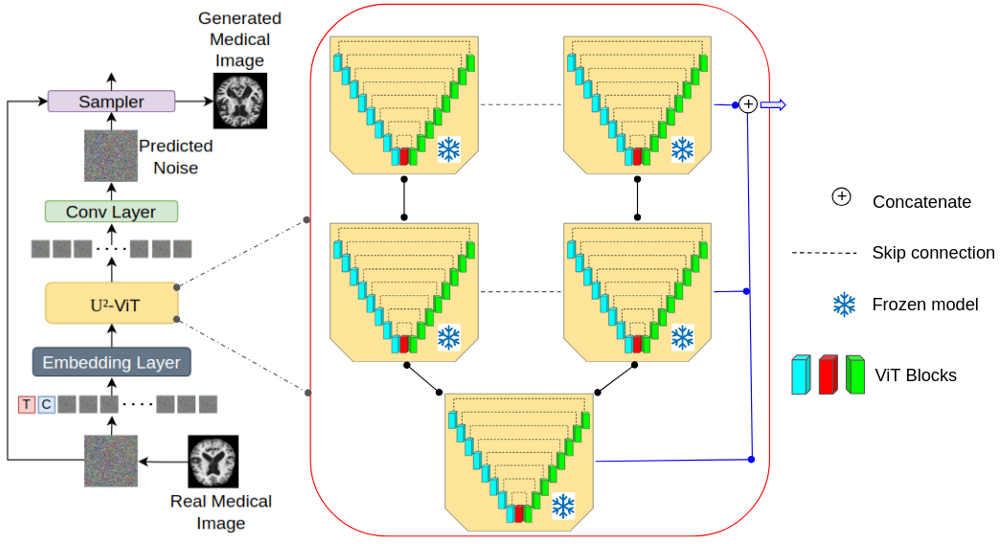

# MedNet for Medical Images Generation with U2-ViT

This repository contains the official implementation of the paper:

**"MedNet for Medical Images Generation with U2-ViT"**

We introduce **MedNet**, a comprehensive medical image dataset, and propose a novel image generation pipeline using **U2-ViT** tailored for high-quality synthetic medical image generation. Our approach demonstrates superior results compared to existing text-to-image generative models in the medical imaging domain.

---

## 🧬 MedNet Dataset Construction Pipeline


---

## 🧠 Medical Image Generation with U2-ViT



---

## 🖼️ Generated Images (256×256) by U2-ViT Trained on MedNet


---

## 📊 Comparison with SOTA Text-to-Image Models


---
## 🚀 Training U2-ViT on MedNet

To train the **U2-ViT** model on the **MedNet** dataset using mixed precision and multi-GPU setup, use the following command:

```bash
accelerate launch \
  --multi_gpu \
  --gpu_ids 0,1 \
  --main_process_port 20019 \
  --num_processes 2 \
  --mixed_precision fp16 \
  train_t2i_discrete.py \
  --config=configs/mednet_u2_v2s.py \
  --config.nnet.depth=16
