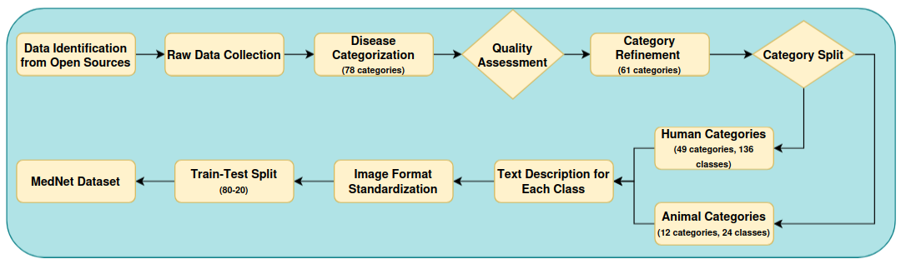

# MedNet for Medical Images Generation with U2-ViT

This repository contains the official implementation of the paper:

**"MedNet for Medical Images Generation with U2-ViT"**

We introduce **MedNet**, a comprehensive medical image dataset, and propose a novel image generation pipeline using **U2-ViT** tailored for high-quality synthetic medical image generation. Our approach demonstrates superior results compared to existing text-to-image generative models in the medical imaging domain.

---

## 🧬 MedNet Dataset Construction Pipeline

---

## 🧠 Medical Image Generation with U2-ViT

---

## 🖼️ Generated Images (256×256) by U2-ViT Trained on MedNet

---

## 📊 Comparison with SOTA Text-to-Image Models

---
